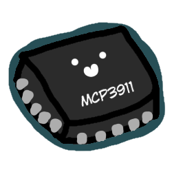

  

<h1 align="center">MCP3911</h1>

A simple driver for the 4 channel ADC MCP3911 chip.

---

I am using this as my first C++ project and first "production-ready" driver, so I comment the code
in a way that I can actually understand what I'm doing and if other people are interested in learning
they can also read them.

### How to use
You can find example usage in the `examples` folder.
